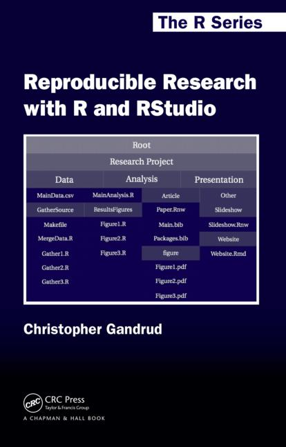

## Introduction

* Enterprise risk
  * Multiple users and last minute requests make it difficult to change a document safely. Interim changes are lost.
  * Research may be easily shared and reproduced.

## Case studies

* Duke study
* Austerity vs. GDP (http://www.nber.org/papers/w15639.pdf)
* Tibco acquisition (http://ww2.cfo.com/spreadsheets/2014/10/spreadsheet-error-costs-tibco-shareholders-100m/)

## Git

## What is git?

* Invented by Linus Torvalds
* Very popular
* Permits all of the changes to be tracked in a structured way

## Uses

* Save stages of development of a model
* Collaborate with colleagues without losing your changes
* Exchange data in the cloud

## Live example

## R Markdown

## What is R Markdown?

* Markdown uses very simple formatting syntax to focus on text
* RMarkdown embeds code with the text and places output into the document
* Can render documents as HTML, PDF or DOCX
* No need to copy and paste analysis or exhibits from Excel into Word

## Live example

* Change the output format
* Change the model assumption

# Conclusion